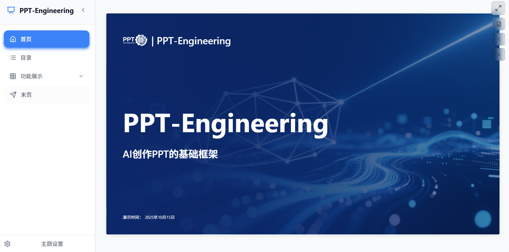
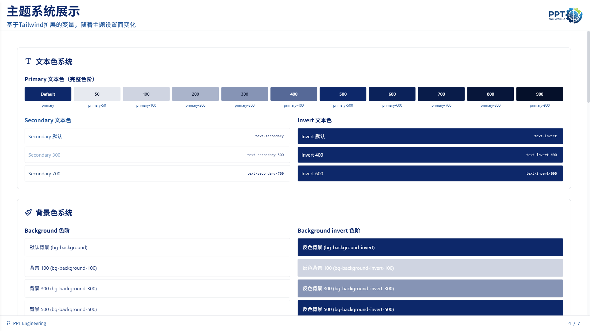
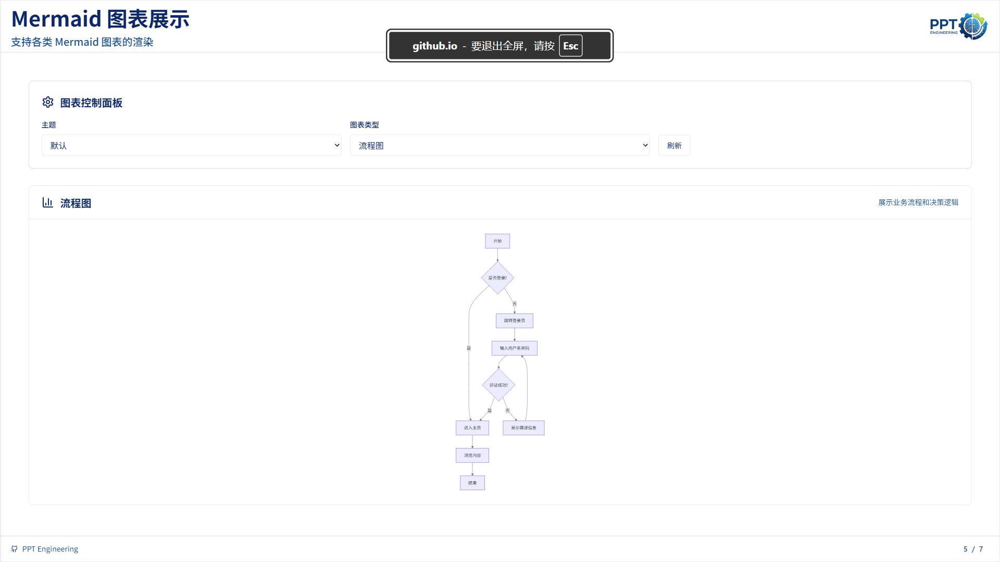
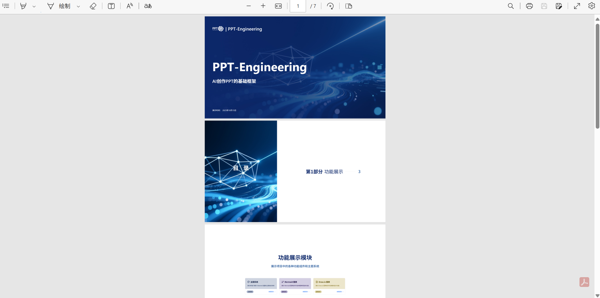

# PPT Engineering
- 基于大模型当前通用能力强，但是没有记忆能力，长上下文昂贵且不稳定的现状，尝试构建一个框架，降低上下文依赖，为AI编写PPT构建基础；实现完全自定义的PPT页面构建而不是让AI套模板
- 作者是个产品经理，没有实际代码经验，项目代码完全依赖于AI，因此项目结构与实现方式可能有一定局限性。欢迎反馈与建议，共同完善项目。

## Demo 展示
- [PPT Engineering Demo](https://llmxpm.github.io/PPT-Engineering/)

### 产品截图






## 设计理念
- 项目脱离 .ppt文件，使用vue直接构建页面
- 配置驱动：核心配置集中于 `public/config/*.yaml`，包括应用基础信息（app.config.yaml）、路由（routes.config.yaml）、主题（themes.config.yaml）、图标（icons.config.yaml）。绝大多数变更无需改动源码，只需调整配置。
- 组件化页面容器：提供标准的页面容器组件（如 `DefaultContentPage`、`DefaultCoverPage`、`DefaultContainer`），统一尺寸与三段式布局，保证风格一致；内容区域以插槽方式自由扩展。
- 降低上下文依赖：将页面内容与路由配置分离，页面文件仅关注内容，同时使用统一的组件容器，多数情况下只需要关注单一的页面vue文件。
- 统一主题风格：扩展tailwindcss的主题配置，提供统一的颜色、字体

## 主要功能
- 页面管理：管理src/views 目录下的页面文件即可，单个页面只需关注单个文件。
- 路由配置：通过 `public/config/routes.config.yaml` 即可快速配置路由，支持模块、子路由、自定义元数据（如标题、图标、排序等）。
- 主题切换：提供主题系统（可配置logo、颜色、字体大小等），同时在theme.config.yaml中可快速修改、增加主题。
- 图标支持：统一的 `Icon` 组件，集成 Lucide 图标库+自定义图标，支持按需使用，增加、删除在icons.config.yaml中即可完成配置。
- 全屏放映：支持将页面全屏展示，提供翻页按钮，同时监听PageUp/Down、空格、左、右键等常用翻页按键。
- 页面导出: 基于snapdom库，支持将页面导出为全图PDF文件。
- 默认页面：提供了默认的homepage、endpage、tableofcontents页面，分别对应PPT的首页、结束页、目录页，可自行修改

## 安装与使用指南
1. 环境准备
   - Node.js ≥ 18
   - 推荐使用 pnpm（也可使用 npm）
   - clone项目：`git clone https://github.com/yourusername/ppt-engineering.git`
2. 安装依赖
   - 使用 pnpm：`pnpm install`
   - 使用 npm：`npm install`
3. 本地开发
   - 运行：`pnpm dev`（或 `npm run dev`）
   - 访问：
     - 若 `public/config/app.config.yaml` 中 `app.baseUrl` 为 `/`：打开 `http://localhost:5173/`
     - 若 `app.baseUrl` 为 `/PPT/`：打开 `http://localhost:5173/PPT/`
4. 构建与本地预览
   - 构建：`pnpm build`（或 `npm run build`），产物输出至 `dist/`
   - 预览：`pnpm preview`（或 `npm run preview`）
   - 访问：`http://localhost:4173/`（若设置了 `baseUrl` 为非 `/`，请在路径后拼接该前缀）
5. 部署建议
   - GitHub Pages 等子路径部署时，将 `app.baseUrl` 设置为仓库名前缀（例如 `/PPT/`）。根路径部署（主域名）则设置为 `/`。

## 页面快速创建指南（简版）
1. 在 `src/views` 下创建页面文件（例如 `src/views/my-new-module/MyNewPage.vue`）。
2. 选择并使用页面容器组件（示例以 `DefaultContentPage` 为例）：

```vue
<template>
  <DefaultContentPage title="我的新页面" subtitle="页面副标题">
    <template #content>
      <div class="space-y-6 p-6">
        <div class="flex items-center mb-4">
          <Icon name="FileText" :size="24" />
          <h2 class="font-heading text-2xl font-semibold text-primary ml-2">页面内容</h2>
        </div>
        <p class="font-body text-secondary leading-relaxed">这里是页面的主要内容区域。</p>
      </div>
    </template>
  </DefaultContentPage>
</template>

<script setup lang="ts">
import DefaultContentPage from '@/components/layout/pagecontainer/DefaultContentPage.vue'
import Icon from '@/components/layout/contentcommon/Icon.vue'
</script>
```

3. 在 `public/config/routes.config.yaml` 中添加对应路由：

```yaml
routes:
  - route: "my-new-module"
    component: "@/views/my-new-module/MyNewPage.vue"
    meta:
      title: "我的新页面"
      icon: "FileText"
      order: 10
```

4. 运行开发服务并验证页面与样式。

如需更丰富的示例与说明，请参考下方文档链接中的“页面创建指南”。

## 文档链接
- 页面创建指南：[docs/page-creation-guide.md](docs/page-creation-guide.md)
- 主题系统使用指南：[docs/theme-usage-guide.md](docs/theme-usage-guide.md)
- 图标系统使用指南：[docs/icon-system-guide.md](docs/icon-system-guide.md)
- 路由配置指南：[docs/routes-config-guide.md](docs/routes-config-guide.md)

## TodoList
- [ ] 主题系统增加调色板，方便增加、切换主题
- [ ] 页面切换动画优化
- [ ] 增加Echart图表渲染能力
- [ ] 页面比例支持配置

## 许可证
本项目遵循 GPL-3.0-or-later 许可协议（见 `LICENSE`）。